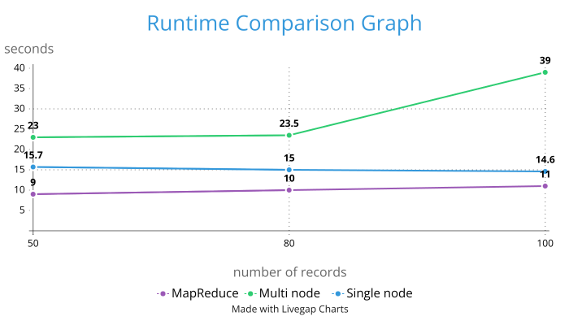

# HW3

## Ex 1.

Implementation for Exercise 1 can be found in `com.h3.ex1.MaxGrade`. Below is the comparison of runtime for different dataset sizes. Datasets with 50, 80, and 100 were used in the previous lab, so the same sized datasets were used this time as well. From the results we can conclude that mapreduce job works better than hadoopstreaming in terms of speed. The mapreduce job performed better than both single node and multinode hadoopstreaming processes, however, to get a better illustration and as a result, end up with a better conclusion, both mapreduce and hadoopstreaming jobs had to be done in very small, medium and very large datasets that have huge size difference between each other.

## Ex 2. Avro

### 1.

- **Specific API:** With specific API, we define data structures in Avro files and generate corresponding Java classes. This is useful when type safety is crucial and we are familiar with the data structures used.
- **Generic API:** Using schema files without generating Java classes. It's beneficial when generating or rewriting Java classes is expensive, or when schemas are loosely defined.
- **Reflect API:** Serialize and deserialize Java classes without explicitly defining a schema. Ideal for quick prototyping and when data structures frequently change, minimizing the need for regenerating classes.

### 2.

Implementation for Exercise 2 can be found in `java.com.h3.ex2.MaxGrade`.

## Ex 3. Bloom Filter

### 1.

A Bloom filter is a space-efficient data structure used to probabilistically check membership in a set. It uses multiple hash functions to map elements to a fixed-size bit array. Adding an element sets specific bits to 1. To check membership, hash the element and check if all corresponding bits are 1, indicating potential membership (with a chance of false positives). If any bit is 0, the element is definitely not in the set.

### 2.

Implementation for Exercise 3 can be found in `com.h3.ex3.BFjob`.
