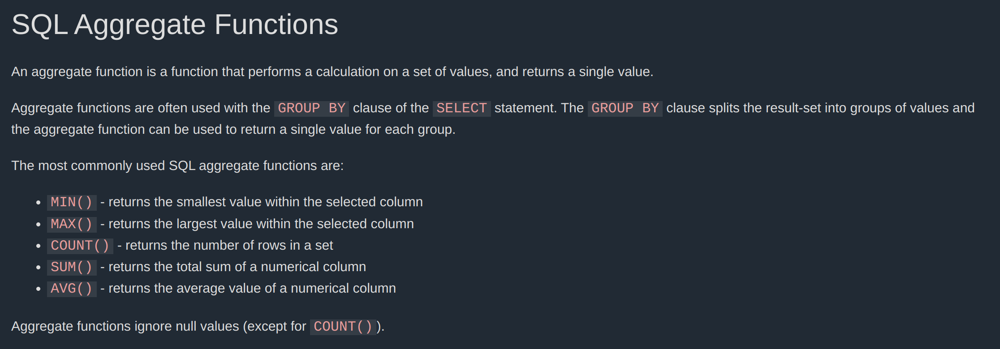
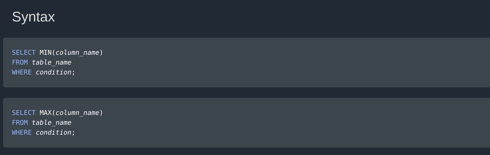
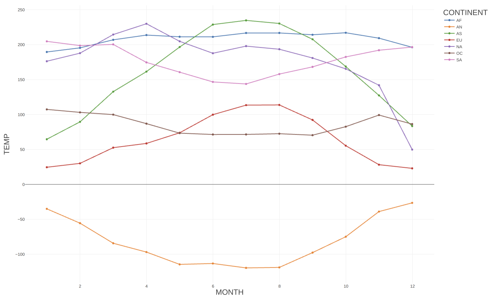
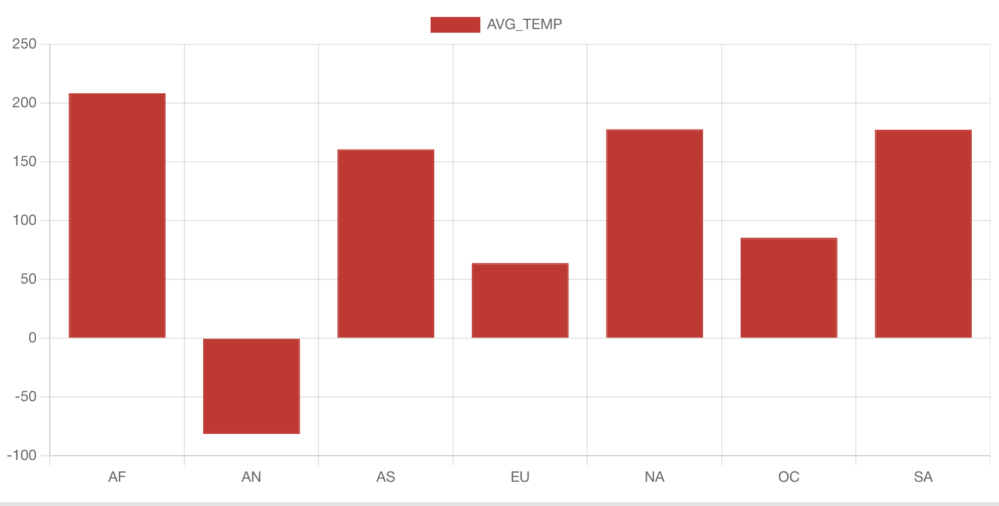

# HW3

## Ex 1.

### 1.

I learned about Join and aggregate operations from w3schools.com . I would explain the same thing from w3schools.com anyway. So instead of paraphrasing their sentences, I will leave the most important parts here:

### 2.

### 3.

Created tables and imported 2022.csv, 2023.csv and 2024.csv using following command:

~~~sqlline
CREATE TABLE weather_2024 AS SELECT
COLUMNS[0] AS ID,
COLUMNS[1] AS DATEE,
COLUMNS[2] AS ELEMENT,
COLUMNS[3] AS DATA_VALUE,
COLUMNS[4] AS M_FLAG,
COLUMNS[5] AS Q_FLAG,
COLUMNS[6] AS S_FLAG,
COLUMNS[7] AS OBS_TIME
FROM `2024.csv`;
~~~

3 advanced nested queries:

1. Find the average temperature (TMIN and TMAX) for each station per month in 2022
~~~sqlline
SELECT 
    ID, 
    SUBSTR(DATEE, 1, 6) AS MONTH, 
    AVG(TMIN) AS AVG_TMIN, 
    AVG(TMAX) AS AVG_TMAX
FROM (
    SELECT 
        ID, 
        DATEE, 
        CASE WHEN ELEMENT = 'TMIN' THEN DATA_VALUE ELSE NULL END AS TMIN, 
        CASE WHEN ELEMENT = 'TMAX' THEN DATA_VALUE ELSE NULL END AS TMAX
    FROM 
        weather_2022
) AS temp
WHERE 
    TMIN IS NOT NULL OR TMAX IS NOT NULL
GROUP BY 
    ID, 
    SUBSTR(DATEE, 1, 6)
ORDER BY 
    ID, 
    MONTH;
~~~

Output sample (the actual output was very long):

~~~sqlline
+-------------+--------+---------------------+---------------------+
| CA003081690 | 202209 | 32.266666666666666   | 205.6                |
| CA003081690 | 202210 | -15.107142857142858  | 131.46428571428572   |
| CA003081690 | 202211 | -134.85185185185185  | -39.96296296296296   |
| CA003081690 | 202212 | -238.67741935483872  | -142.8709677419355   |
| CA004010811 | 202201 | -206.5483870967742   | -76.25806451612904   |
| CA004010811 | 202202 | -219.17857142857142  | -89.82142857142857   |
| CA004010811 | 202203 | -110.12903225806451  | -12.35483870967742   |
| CA004010811 | 202204 | -42.233333333333334  | 57.06666666666667    |
| CA004010811 | 202205 | 30.032258064516128   | 188.51612903225808   |
| CA004010811 | 202206 | 86.76666666666667    | 244.73333333333332   |
| CA004010811 | 202207 | 119.38709677419355   | 256.7096774193548    |
| CA004010811 | 202208 | 112.0                | 265.46666666666664   |
| CA004010811 | 202209 | 54.63333333333333    | 231.03333333333333   |
| CA004010811 | 202210 | -12.67741935483871   | 128.06451612903226   |
| CA004010811 | 202211 | -127.56666666666666  | -32.5                |
| CA004010811 | 202212 | -215.16666666666666  | -125.7               |
~~~

2. Count the number of days with precipitation (PRCP > 0) for each station in 2022
~~~sqlline
SELECT 
    ID, 
    COUNT(*) AS DAYS_WITH_PRCP
FROM (
    SELECT 
        ID, 
        DATEE, 
        CASE WHEN ELEMENT = 'PRCP' AND DATA_VALUE > 0 THEN 1 ELSE NULL END AS PRCP_FLAG
    FROM 
        weather_2022
) AS temp
WHERE 
    PRCP_FLAG IS NOT NULL
GROUP BY 
    ID
ORDER BY ID ASC;
~~~

Output sample (the actual output was very long):

~~~sqlline
+-------------+----------------+
| US1KSSG0114 | 63             |
| US1KSSG0115 | 78             |
| US1KSSG0116 | 81             |
| US1KSSG0123 | 39             |
| US1KSSG0124 | 81             |
| US1KSSG0125 | 63             |
| US1KSSG0126 | 67             |
| US1KSSG0127 | 47             |
| US1KSSG0128 | 47             |
| US1KSSG0129 | 91             |
| US1KSSG0130 | 96             |
| US1KSSG0133 | 91             |
| US1KSSG0140 | 57             |
| US1KSSG0141 | 2              |
| US1KSSG0143 | 51             |
| US1KSSG0144 | 79             |
| US1KSSG0145 | 30             |
| US1KSSG0151 | 58             |
| US1KSSG0157 | 79             |
| US1KSSG0159 | 79             |
| US1KSSG0162 | 44             |
~~~

3. Find the maximum snowfall (SNOW) recorded for each station in 2022

~~~sqlline
SELECT 
    ID, 
    MAX(SNOWFALL) AS MAX_SNOWFALL
FROM (
    SELECT 
        ID, 
        CASE WHEN ELEMENT = 'SNOW' THEN DATA_VALUE ELSE NULL END AS SNOWFALL
    FROM 
        weather_2022
) AS temp
WHERE 
    SNOWFALL IS NOT NULL
GROUP BY 
    ID
ORDER BY 
    MAX_SNOWFALL ASC;
~~~

Output sample (the actual output was very long):

~~~sqlline
+-------------+--------------+
| USC00471847 | 99           |
| USC00407834 | 99           |
| USC00236826 | 99           |
| USC00202851 | 99           |
| USC00201896 | 99           |
| USC00135992 | 99           |
| USC00131257 | 99           |
| USC00126864 | 99           |
| USC00052223 | 99           |
| US1AKFN0033 | 99           |
| US1MEPS0009 | 99           |
| US1NYGN0006 | 99           |
| US1COLR1109 | 99           |
| CA1PE000074 | 99           |
| US1VTFR0021 | 99           |
| USC00487529 | 99           |
| US1COSU0061 | 99           |
| US1COJF0471 | 99           |
| CA1BC000057 | 99           |
| US1MNGH0030 | 99           |
| US1WYSH0018 | 99           |
| US1MIBN0024 | 99           |
| US1IASR0019 | 99           |
| US1MNBN0007 | 99           |
| US1NYBM0021 | 99           |
| US1COWE0171 | 99           |
| US1NYER0203 | 991          |
+-------------+--------------+
~~~

## Ex 2. Holidays!

### 1. If precipitation is less than 2 mm per day, the average daily temperature is between 20 and 30 degrees Celsius, and daily max and min temperature difference is less than 15 and greater than 5 degrees Celsius (moderate and stable temperature), then the weather is perfect weather

### 2. 

Ran the following query to merge the tables into a single table that contains august daily temperature:

~~~sqlline
CREATE OR REPLACE VIEW august_weather AS
SELECT 
    ID, 
    DATEE,
    AVG(CASE WHEN ELEMENT = 'TMIN' THEN DATA_VALUE ELSE NULL END) OVER (PARTITION BY ID, DATEE) AS TMIN,
    AVG(CASE WHEN ELEMENT = 'TMAX' THEN DATA_VALUE ELSE NULL END) OVER (PARTITION BY ID, DATEE) AS TMAX,
    AVG(CASE WHEN ELEMENT = 'PRCP' THEN DATA_VALUE ELSE NULL END) OVER (PARTITION BY ID, DATEE) AS PRCP,
    AVG(CASE WHEN ELEMENT = 'TOBS' THEN DATA_VALUE ELSE NULL END) OVER (PARTITION BY ID, DATEE) AS TOBS
FROM 
    weather_2022
WHERE
    SUBSTR(DATEE, 5, 2) = '08'
UNION ALL
SELECT 
    ID, 
    DATEE,
    AVG(CASE WHEN ELEMENT = 'TMIN' THEN DATA_VALUE ELSE NULL END) OVER (PARTITION BY ID, DATEE) AS TMIN,
    AVG(CASE WHEN ELEMENT = 'TMAX' THEN DATA_VALUE ELSE NULL END) OVER (PARTITION BY ID, DATEE) AS TMAX,
    AVG(CASE WHEN ELEMENT = 'PRCP' THEN DATA_VALUE ELSE NULL END) OVER (PARTITION BY ID, DATEE) AS PRCP,
    AVG(CASE WHEN ELEMENT = 'TOBS' THEN DATA_VALUE ELSE NULL END) OVER (PARTITION BY ID, DATEE) AS TOBS
FROM 
    weather_2023
WHERE
    SUBSTR(DATEE, 5, 2) = '08'
UNION ALL
SELECT 
    ID, 
    DATEE,
    AVG(CASE WHEN ELEMENT = 'TMIN' THEN DATA_VALUE ELSE NULL END) OVER (PARTITION BY ID, DATEE) AS TMIN,
    AVG(CASE WHEN ELEMENT = 'TMAX' THEN DATA_VALUE ELSE NULL END) OVER (PARTITION BY ID, DATEE) AS TMAX,
    AVG(CASE WHEN ELEMENT = 'PRCP' THEN DATA_VALUE ELSE NULL END) OVER (PARTITION BY ID, DATEE) AS PRCP,
    AVG(CASE WHEN ELEMENT = 'TOBS' THEN DATA_VALUE ELSE NULL END) OVER (PARTITION BY ID, DATEE) AS TOBS
FROM 
    weather_2024
WHERE
    SUBSTR(DATEE, 5, 2) = '08';
~~~

Ran the following query to find the best location for summer vacation in August:

~~~sqlline
SELECT 
    ID,
    AVG((TMIN + TMAX) / 20.0) AS AVG_TEMP, -- Divide by 20 to get average in degrees Celsius
    AVG(PRCP / 10.0) AS AVG_PRCP, -- Divide by 10 to get precipitation in millimeters
    AVG((TMAX - TMIN) / 10.0) AS AVG_TEMP_AMPLITUDE -- Divide by 10 to get amplitude in degrees Celsius
FROM 
    august_weather
WHERE
    PRCP <= 20 AND
    (TMIN + TMAX) / 20.0 BETWEEN 20 AND 30 AND
    (TMAX - TMIN) / 10.0 BETWEEN 5 AND 15
GROUP BY 
    ID
ORDER BY 
    AVG_TEMP DESC, AVG_PRCP ASC, AVG_TEMP_AMPLITUDE ASC
LIMIT 1;
~~~

Output:

~~~sqlline
+-------------+----------+----------+--------------------+
|     ID      | AVG_TEMP | AVG_PRCP | AVG_TEMP_AMPLITUDE |
+-------------+----------+----------+--------------------+
| IN001111200 | 300.0    | 0.0      | 66.0               |
+-------------+----------+----------+--------------------+
~~~

Ran the following command in terminal to identify where this Station ID corresponds to:

~~~console
cat ghcnd-stations.txt | grep "IN001111200"
~~~

The station ID IN001111200 corresponds to MACHILIPATNAM City in India, the perfect location for vacation in August.

## Ex 3. Data Visualization

### 1.

~~~sqlline
CREATE TABLE temp_variation AS
SELECT country_continent.CONTINENT AS CONTINENT,
    SUBSTR(weather_2023.DATEE, 5, 2) AS MONTH,
    AVG(CAST(weather_2023.DATA_VALUE AS FLOAT)) AS TEMP
FROM weather_2023
    INNER JOIN country_continent
        ON SUBSTR(weather_2023.ID, 1, 2) = country_continent.FIPS
GROUP BY country_continent.CONTINENT, MONTH
ORDER BY country_continent.CONTINENT, MONTH;

+----------+---------------------------+
| Fragment | Number of records written |
+----------+---------------------------+
| 0_0      | 84                        |
+----------+---------------------------+

SELECT * FROM temp_variation LIMIT 20;

+-----------+-------+---------------------+
| CONTINENT | MONTH |        TEMP         |
+-----------+-------+---------------------+
| AF        | 01    | 189.59039719981737  |
| AF        | 02    | 195.50155234507596  |
| AF        | 03    | 207.00921153635267  |
| AF        | 04    | 213.79183673469387  |
| AF        | 05    | 211.3557385666725   |
| AF        | 06    | 211.2473217126896   |
| AF        | 07    | 216.77589088721     |
| AF        | 08    | 216.82124783479944  |
| AF        | 09    | 214.25113089681912  |
| AF        | 10    | 217.1269463592148   |
| AF        | 11    | 209.36895446754602  |
| AF        | 12    | 196.29009963513892  |
| AN        | 01    | -34.95829811214426  |
| AN        | 02    | -55.50239693192713  |
| AN        | 03    | -84.27847730600293  |
| AN        | 04    | -96.8920217878885   |
| AN        | 05    | -114.53565008987418 |
| AN        | 06    | -113.25155788783208 |
| AN        | 07    | -119.56871890547264 |
| AN        | 08    | -118.86103105987833 |
+-----------+-------+---------------------+
~~~

graph:

### 2.

~~~sqlline
SELECT CONTINENT, AVG(TEMP) AS AVG_TEMP FROM temp_variation GROUP BY CONTINENT;

+-----------+--------------------+
| CONTINENT |      AVG_TEMP      |
+-----------+--------------------+
| AF        | 208.26086068133586 |
| AN        | -81.32108326600637 |
| AS        | 160.5479809952191  |
| EU        | 63.817696772476516 |
| NA        | 177.59346115601514 |
| OC        | 85.42147734138437  |
| SA        | 177.27182495475597 |
+-----------+--------------------+
~~~

graph:

