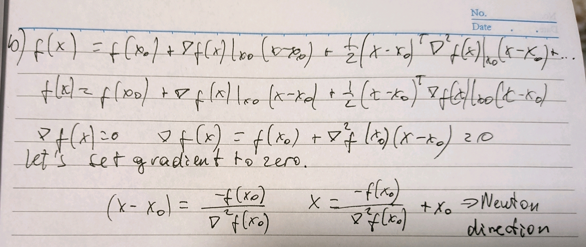

# Homework 6

## Ex. 1

### 1.
#### a)
- The **Jacobian** of a multivariate function \( f \) at \( x \) is the matrix of all first-order partial derivatives of \( f \). It is denoted by \( \nabla f(x) \).
- The **Hessian** of a multivariate function \( f \) at \( x \) is the square matrix of second-order partial derivatives of \( f \). It is denoted by \( \nabla^2 f(x) \).

#### b)


### 2.

#### a) In gradient descent, we iteratively update \( x \) in the direction of the steepest descent (negative gradient):
\[ x_{k+1} = x_k - \alpha \nabla f(x_k) \]

Using the Newton direction, the update becomes:
\[ x_{k+1} = x_k - \alpha (\nabla^2 f(x_k))^{-1} \nabla f(x_k) \]

#### b) - **Cost of inverting the Hessian:** Computing the inverse of the Hessian matrix is computationally expensive, especially for high-dimensional data.
- **Adjusted step-size:** Inverting the Hessian adjusts the step size based on the curvature of the function, potentially leading to faster convergence.

### 3.

#### a) Jacobian of \( f \) in terms of \( r \)
Given \( f(w) = \frac{1}{2} \sum_{i=1}^m \|x_i^\top w - y_i\|^2 = \frac{1}{2} \|r(w)\|^2 \), the residual \( r(w) = Xw - y \):
\[ \nabla f(w) = J^\top r(w) \]

#### b) Hessian of \( f \) in terms of its Jacobian
The Hessian \( \nabla^2 f(w) \) is:
\[ \nabla^2 f(w) = J^\top J \]

### 4. Jacobian Matrix \( J \)

#### a) Using (1.1), showing \( w = -(J^\top J)^{-1} J^\top r(w) \)
From the Taylor expansion, setting the gradient to zero:
\[ \nabla f(w) = J^\top r(w) = 0 \]

Thus,
\[ w = -(J^\top J)^{-1} J^\top r(w) \]

#### b) Applying SVD to \( J^\top J \)
Using SVD:
\[ J^\top J = U \Sigma U^\top \]

Where \( U \) and \( V \) are orthogonal matrices, and \( \Sigma \) is a diagonal matrix:
\[ w = -V (\Sigma^\top \Sigma)^{-1} \Sigma^\top U^\top J^\top r(w) \]

#### c) Truncated SVD
Truncate \( U \) into \( U_t \):
\[ w = -V \Sigma^{-1} U_t J^\top r(w) \]

### 5.
1. Initialize \( w \)
2. Repeat until convergence:
   - Compute \( r(w) = Xw - y \)
   - Compute \( J \)
   - Update \( w = w - \alpha (J^\top J)^{-1} J^\top r(w) \)

### 6. Performance Comparison
This algorithm uses the curvature information (Hessian) for faster convergence unlike standard gradient descent which only uses the gradient. This makes it more efficient.


## Ex. 2 — PRAM

### 1.
1.
- a) To calculate the XOR of all elements in an array sequentially, you simply iterate through the array, applying the XOR operation to each element. Here’s a pseudocode representation of the sequential algorithm:

```python
def sequential_xor(A):
    S = 0
    for i in range(len(A)):
        S = S ^ A[i]
    return S
```

- b) In the code above, we are iterating the array and doing O(1) work, so the overall time complexity is O(n) where n is the length of the array.
2.
- a)
```pseudocode
Pseudocode for Parallel XOR using Spark

1. Initialize SparkContext
2. Create an RDD from the input array A
3. Define a function to XOR two elements
4. Perform a tree reduction using the XOR function

Algorithm parallel_xor(A):
    1. Initialize SparkContext sc
    2. Create an RDD rdd from array A using sc.parallelize(A)
    3. Define XOR function:
        def xor_func(x, y):
            return x ^ y
    4. Use treeReduce to compute the XOR of all elements:
        result = rdd.treeReduce(xor_func)
    5. Return result
```
- b) Since we are calculating the xor of all elements in an array, we are doing O(n) work. The depth is log(n) in worst case, so O(log(n)).
- c) In sequential processing (on single processor), the total work done and the depth are the same since only one processor works on the process. But in parallel, the total time it takes for the process to finish is determined by the depth of the algorithm. In sequential processing, the time complexity is O(n) and in parallel the depth is O(log(n)). So the algorithm above is way more efficient and finishes earlier than sequential processing with O(n).

## Ex. 3 - Gradient Descent in Spark

### 1.
```python
from pyspark.sql import SparkSession
from pyspark.ml.linalg import Vectors
from pyspark.sql.functions import col, udf
from pyspark.sql.types import DoubleType

# initializing spark session
spark = SparkSession.builder.appName("BatchGradientDescent").getOrCreate()
data = spark.read.csv("path_to_dataset.csv", header=True, inferSchema=True)

data = data.withColumn("features", udf(lambda row: Vectors.dense(row), VectorUDT())(col("features")))

iterations = 100
learning_rate = 0.01

weights = Vectors.dense([0.0 for _ in range(data.select("features").first()[0].size)])

for i in range(iterations):
    gradient = data.rdd.map(lambda row: (row.label - weights.dot(row.features)) * row.features).reduce(lambda x, y: x + y)
    weights += learning_rate * gradient

print("Final weights:", weights)
```
### 2.
```python
def stochastic_gradient_descent(data, learning_rate, iterations):
    m = data.count()
    X = np.array(data.select("features").collect()).reshape(m, -1)
    y = np.array(data.select("label").collect()).reshape(m, 1)
    n = X.shape[1]
    theta = np.zeros((n, 1))
    
    for _ in range(iterations):
        for i in range(m):
            xi = X[i].reshape(1, -1)
            yi = y[i]
            gradient = xi.T.dot(xi.dot(theta) - yi)
            theta -= learning_rate * gradient
    return theta
```