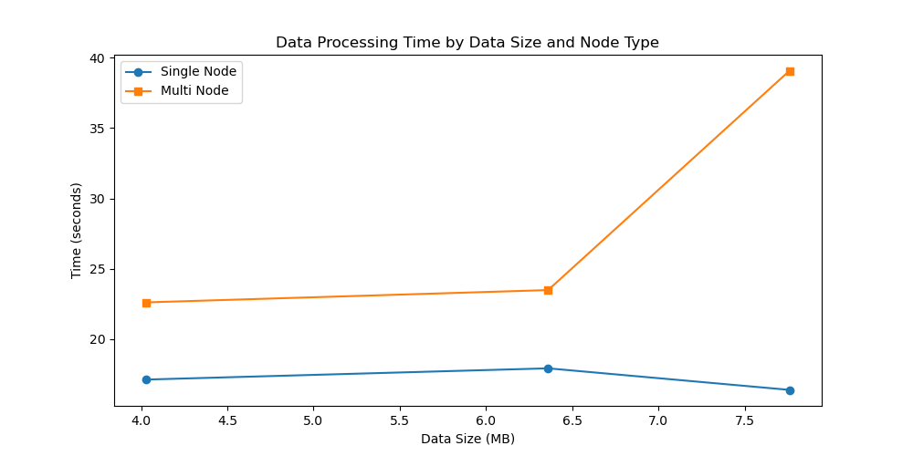

# VE472 Lab02 Report

Meng Zi, Bunyod Suvonov, Pan Haoyun, Wang Zhiyuan

## Part 1 Data generation

For data generation, see `lab02/src/ex2_1.py` for our code.

For mapper, we can use pipeline to handle the output generated by `ex2_1.py`:

```bash
#!/bin/sh

awk -F "," '{printf "%s\t%s\n", $2, $3}'
```

It means, we use `,` to break every line in fields, and then print the 2nd and 3rd part seperated by TAB and ended by `\n`.

For reducer, we use the following code to reversely sort name, then sort max grade. If the counter of the first field (name) =0, then print it. So we finally sort and print everyone's best score.

```bash
#!/bin/bash

sort -t $'\t' -k 1 -k 2 -r | awk '!x[$1]++'
```

We tried to generate 50, 80 and 100 student's grade data.

## Part 2 Single node performance

For single node on Bunyod's computer:

| Data Size(record number,MB) | 50, 4.03MB | 80, 6.36MB | 100, 7.76MB |
| ------------------- | ------ | ------ | ------ |
| **Real time** | 14.033 | 14.631 | 15.696 |

See `/image` for original records. For single node and relatively small data, the real time keeps stable and even decreased.

## Part 3 Multi node performance

For multinode:

| Data Size(record number,MB) | 50, 4.03MB | 80, 6.36MB | 100, 7.76MB |
| ------------------- | ------ | ------ | ------ |
| **Real time** | 22.614 | 23.488     | 39.084      |

See `/image` for original records. For multinode, the time increased remarkbly as data size goes up.

And finally we can plot the data to compare:



When data size is small, single node is indeed faster. When data size reaches to GB or TB, we guess multi node is faster.

## Discussions

As for cluster setup we had met some issues:

- Virtual machine cannot reach physical machine and throws `No route to host`. We resolve it by installing dual boot. I think it's some Windows issue that the VM's bridged network card cannot access the Ethernet.
- In the cluster, when exec `start-dfs.sh`, it fails to set up `hdfs namenode -format`, for `hadoopuser` didn't have write permission to the directory.
- In node manager some nodes not recognized, because in `hdfs-site.xml` there is redundant `<configuration>`.
- My (Wang Zhiyuan) computer failed, and I guess there is too much CPU usage, so we just leave it and the cluster still goes on. I think `STONOTH` technique is useful.

And hopefully we fixed all of them with the help of TA.
